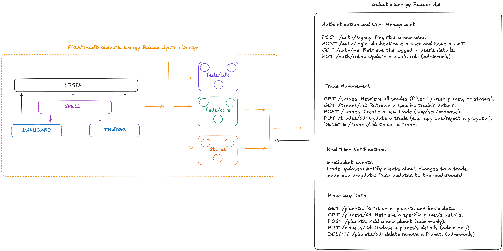
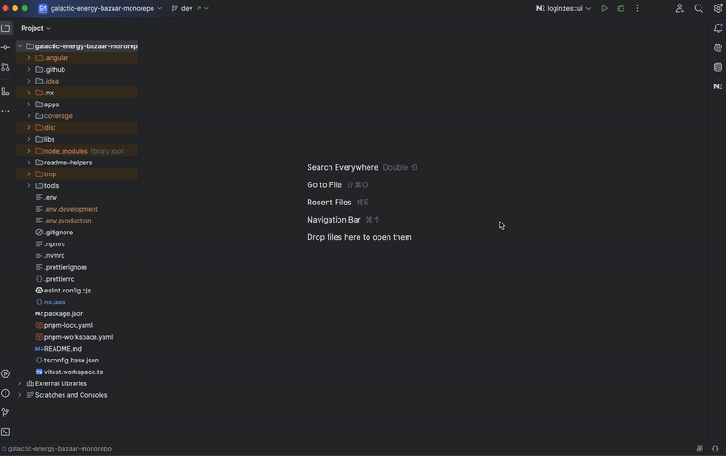

# Galactic Energy Bazaar

## Overview
This monorepo implements a scalable and modular architecture for the **Galactic Energy Bazaar** platform using modern web development technologies. The project is designed to address real-world challenges in security, real-time updates, localization, and performance, leveraging the following stack:

- **Micro-frontend architecture**: Using Module Federation.
- **Monorepo management**: Powered by Nx.
- **Frontend framework**: Angular v19 with standalone components and Signals.
- **Design system**: Reusable libraries for components, core funcionality, stores and APIs.
- **Build tools**: Webpack and pnpm.
- **Testing**: Vitest for unit testing and Cypress for end-to-end tests.

---

## Prerequisites
1. Node.js 22.13.0 (managed with `.nvmrc`).
2. PNPM as the package manager for the front end.
3. NPMM as the package manager for the back end

### Installation

## FRONT END
1. Clone the repository:
   ```bash
   git clone git@github.com:samdofe/galactic-energy-bazaar-monorepo.git
   cd galactic-energy-bazaar-monorepo
   ```
2. Install dependencies:
   ```bash
   pnpm install
   ```
3. Start Shell App:
   ```bash
   pnpm serve:shell
   ```
___

## BACK END
1. Clone the repository:
   ```bash
   git clone git@github.com:samdofe/galactic-energy-bazaar-api.git
   cd galactic-energy-bazaar-api
   ```
2. Install dependencies:
   ```bash
   npm install
   ```
3. Add environment variables:
    - Contact the Author to provide valid environment variables

4 Start Shell App:
   ```bash
   npm run dev
   ```
___

## Monorepo Structure
- **`apps/`**: Contains the main applications.
    - **`shell/`**: Host application.
    - **`login/`**: Remote application that handles user access .
    - **`dashboard/`**: Remote application that shows planets stats and leaderboards.
    - **`trades/`**: Remote application that shows the current trades dependeing on your role.
- **`libs/`**: Reusable libraries.
    - **`feds-cdk/`**: Component Dev Kit.
    - **`feds-core/`**: Basic functionality libraries.
    - **`feds-styles/`**: Handles the one source of thruth for styles
    - **`stores/`**: Using Ngrx signals implements reactivity to every single application or component
      - **`planets/`**: Using Ngrx signals implements reactivity fetches planetary data from the backend
      - **`socket-io/`**: Listens for real-time updates from the backend
      - **`trades/`**: Manages trade transactions
- **`tools/`**: Custom Nx scripts.
- Key configuration files: `nx.json`, `pnpm-workspace.yaml`, `tsconfig.base.json`.

---

## Frontend System Design



---

## Available Scripts
The scripts are executed from the root directory:

### Development
- **Start all applications**:
  ```bash
  pnpm run serve:shell
  ```
- **Start a specific application** (replace `$PROJECT`):
  ```bash
  PROJECT=shell pnpm serve:app
  ```

### Build
- **Build all applications**:
  ```bash
  pnpm build:shell
  ```
- **Build libraries**:
  ```bash
  pnpm build:libs
  ```

### Testing
- **Run all tests**:
  ```bash
  pnpm test:all
  ```
- **Run tests for a specific project** (replace `$PROJECT`):
  ```bash
  PROJECT=login pnpm test:project
  ```
- **Run tests with the Vitest UI** (replace `$PROJECT`):
  ```bash
  PROJECT=podcast pnpm test:project:ui
  ```

  #### **With Nx Console**:

  

  #### **With the terminal**:

  

  #### **Vitest UI**

  

### Nx Utilities
- **View the dependency graph**:
    - Nx understands your workspace as a collection of projects
    - The projects in the workspace have dependencies between them and form a graph known as the **Project Graph**
    - This project graph allows you to interactively explore your workspace through a UI
      ```bash
      pnpm graph
      ```

      

### Nx Console
- **Additionally, you can install the **Nx console** plugin in your preferred IDE to access all scripts from the Nx dashboard**:

  

---

## Run the Solution

####
- Locally, the applications run on the following ports:
    - (1) The Shell in development mode and the rest as static servers: using the command `pnpm serve:shell`
        - **Shell**: http://localhost:4200 (Development)
        - **Login**: http://localhost:4201 (Static server)
        - **Dashboard**: http://localhost:4202 (Static server)
        - **Trades**: http://localhost:4203 (Static server)
    - (2) In development mode: starting all the applications 
        - **Login**: `pnpm serve:login` http://localhost:4201 (Development)
        - **Dashboard**: `pnpm serve:dashboard` http://localhost:4202 (Development)
        - **Trades**: `pnpm serve:trades` http://localhost:4203 (Development)
        - **Shell**: `pnpm serve:shell` http://localhost:4200 (Development)
####
- **IMPORTANT NOTES :**
    - In development mode (2), the applications work independently of each other
    - Additionally, Dashboard and Trades has Login as remote
####

<

___

## Git Repository
- [**GITHUB** - galactic-energy-bazaar-monorepo](https://github.com/samdofe/mf-music-monorepo):
    - The solution is in a public repository. [the author](https://github.com/samdofe)
    - You can also have a looked at the PR's tab to see the evolution of the solution
####


___

## Featured Tools
- [**Nx**](https://nx.dev):
    - Cache management and smart tasks.
    - Custom commands in `tools/utils`.
- [**Vitest**](https://vitest.dev): Configured for unit tests and coverage visualization.
- [**Vercel**](https://vercel.com): CI/CD pipeline set up for fast deployments.

For more details on the applications and libraries, check the `README.md` files in each subdirectory:

- [Login](./apps/shell/README.md)
- [Shell](./apps/shell/README.md)
- [Dashboard](./apps/shell/README.md)
- [Trades](./apps/podcast/README.md)
- [libs](./libs/README.md)
- [tools](./tools/README.md)


