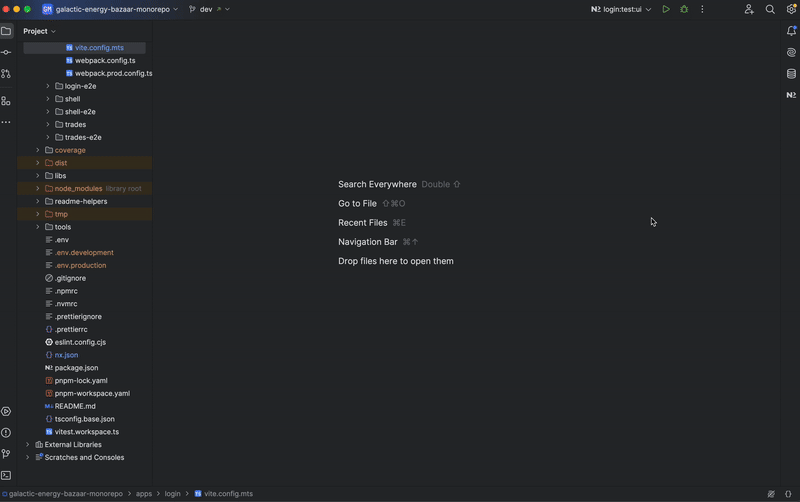
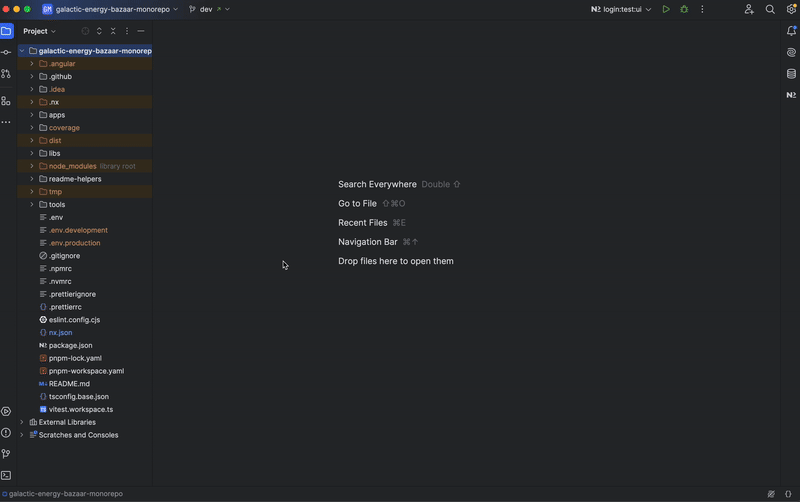
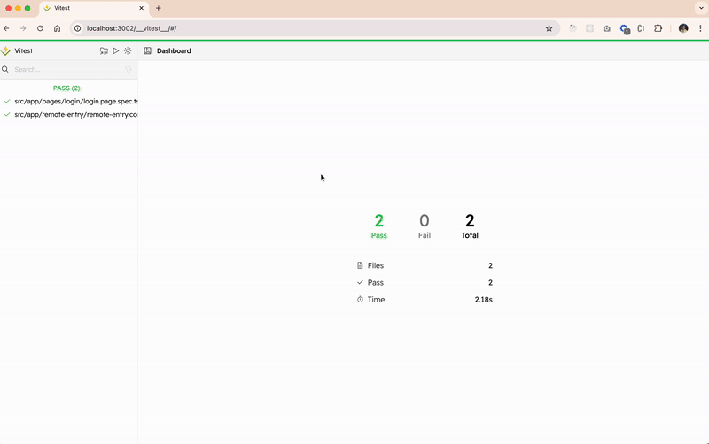

# Dashboard Application

## Description
The **Dashboard** application provides real-time trade statistics, leaderboards, and planetary energy transactions. It is responsible for:
- Displaying real-time market data using **Socket.io**.
- Showing a leaderboard of top traders and planetary trade statistics.
- Integrating with shared UI components and services for consistency across micro-frontends.

---

## Structure
The Dashboard application is structured as follows:

- **`src/index.html`**: The main HTML file where the application is bootstrapped.
- **`src/main.ts`**: The entry point that initializes the Angular application.
- **`src/bootstrap.ts`**: Bootstraps the Angular app with Module Federation.
- **`src/environments/`**: Configuration files for different environments.
- **`src/styles.scss`**: Global styles for the dashboard.
- **`src/app/`**: Contains the core application logic, including:
    - **`app.routes.ts`**: Defines the main routes for the dashboard functionality.
    - **`app.config.ts`**: Configures providers and global settings.
    - **`remote-entry/`**: Defines the entry point for Module Federation.
    - **`models/`**: Contains TypeScript interfaces for defining data structures.
    - **`pipes/`**: Contains custom Angular pipes for formatting data.
    - **`pages/dashboard/`**: Implements the main dashboard page.
        - **`dashboard.page.ts`**: The main component handling data fetching and display logic.
        - **`dashboard.page.html`**: The UI template for the dashboard.
        - **`dashboard.page.scss`**: Styling for the dashboard.
    - **`ui/`**: Contains reusable UI components such as charts and leaderboards.

---

## Module Federation
Module Federation is configured in:
- **`module-federation.config.ts`**: Declares the Dashboard application as a remote module.
- **`webpack.config.ts` & `webpack.prod.config.ts`**: Configures how the Dashboard integrates with the Shell.

---

## Scripts
Run the following commands from the project root:

- **Start the Dashboard application in development mode**:
  ```bash
  pnpm serve:dashboard
  ```

- **Build the Dashboard application**:
  ```bash
  nx build dashboard
  ```

- **Run tests for dashboard project** :
  ```bash
  PROJECT=dashboard pnpm test:project
  ```
- **Run tests with the Vitest UI** :
  ```bash
  PROJECT=dashboard pnpm test:project:ui
  ```

  #### **With Nx Console**:

  

  #### **With the terminal**:

  

  #### **Vitest UI**

  

---

## Real-Time Data Handling
The Dashboard application integrates with **Socket.io** to handle:
- Live trade updates.
- Dynamic ranking of traders and planets.
- Automatic UI refresh when new data arrives.

---

## Notes
1. Ensure the backend service is running to fetch real-time data correctly.
2. Use **`nx graph`** to visualize dependencies between the Dashboard app and other micro-frontends.


---
For more information, consult the general documentation in the root README.
