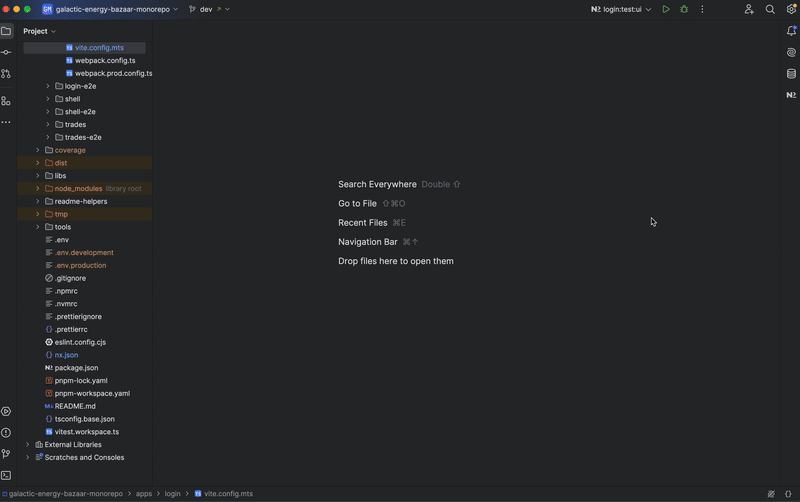

# Shell Application

## Description
The **Shell** application serves as the host in the micro-frontend architecture, responsible for:
- Bootstrapping and dynamically loading remote micro-frontends via **Module Federation**.
- Managing global application state and routing.
- Providing a foundational layout for micro-frontends.
- Rendering shared UI components like the navigation sidebar.

---

## Structure
The Shell application is structured as follows:

- **`src/index.html`**: The main HTML file where the application is bootstrapped.
- **`src/main.ts`**: The entry point that initializes the Angular application.
- **`src/bootstrap.ts`**: Bootstraps the Angular app with Module Federation.
- **`src/environments/`**: Configuration files for different environments.
- **`src/styles.scss`**: Global styles for the shell.
- **`src/app/`**: Contains the core application logic, including:
  - **`app.component.ts`**: The root component for the Shell.
  - **`app.routes.ts`**: Defines the main application routes.
  - **`app.config.ts`**: Configures providers and application-wide settings.
  - **`shell-entry/`**: A standalone module responsible for rendering the Shell layout.
    - **`shell-entry.component.ts`**: Main component for the Shell.
    - **`shell-entry.routes.ts`**: Defines routes within the Shell.

---

## Module Federation
Module Federation is configured in:
- **`module-federation.config.ts`**: Declares remote applications to be loaded dynamically.
- **`webpack.config.ts` & `webpack.prod.config.ts`**: Configures how the Shell integrates with remotes.

---

## Scripts
Run the following commands from the project root:

- **Start the Shell application in development mode**:
  ```bash
  nx serve shell
  ```

- **Build the Shell application**:
  ```bash
  nx build shell
  ```

- **Run tests for shell project** :
  ```bash
  PROJECT=shell pnpm test:project
  ```
- **Run tests with the Vitest UI** :
  ```bash
  PROJECT=shell pnpm test:project:ui
  ```

  #### **With Nx Console**:

  

  #### **With the terminal**:

  

  #### **Vitest UI**

  

---

## Routing
The Shell application uses **Angular Standalone Routing** to manage navigation between micro-frontends:
- The routing is defined in **`app.routes.ts`**.
- Remote micro-frontends are dynamically loaded when a route is accessed.

---

## Shared Components
The Shell integrates reusable UI components, including:
- **Navigation Sidebar** (`feds-cdk-side-nav`).
- **Global Styling** (`feds-styles`).

---

## Notes
1. Ensure that all remote applications are running before testing navigation.
2. Use **`nx graph`** to visualize project dependencies.


---
For more information, consult the general documentation in the root README.