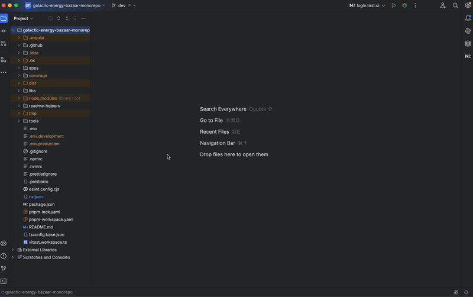

# Trades Application

## Description
The **Trades** application manages trade transactions and history. It is responsible for:
- Displaying a list of trades with filtering and search functionality.
- Allowing users to view trade details based on role-based permissions (admin vs trader view).
- Integrating real-time updates via **Socket.io** to keep trade data fresh.

---

## Structure
The Trades application is structured as follows:

- **`src/index.html`**: The main HTML file where the application is bootstrapped.
- **`src/main.ts`**: The entry point that initializes the Angular application.
- **`src/bootstrap.ts`**: Bootstraps the Angular app with Module Federation.
- **`src/environments/`**: Configuration files for different environments.
- **`src/styles.scss`**: Global styles for the trades interface.
- **`src/app/`**: Contains the core application logic, including:
    - **`app.routes.ts`**: Defines the main routes for the trades module.
    - **`app.config.ts`**: Configures providers and settings.
    - **`remote-entry/`**: Defines the entry point for Module Federation.
    - **`models/`**: TypeScript interfaces for defining trade-related data structures.
    - **`pages/trades-list/`**: Displays the list of trades.
        - **`trades-list.page.ts`**: The main component handling trade list logic.
        - **`trades-list.page.html`**: The UI template for the trade list.
        - **`trades-list.page.scss`**: Styling for the trade list.
    - **`pages/trades-details/`**: Displays trade details for a selected transaction.
        - **`trades-details.page.ts`**: Handles logic for displaying trade details.
        - **`trades-details.page.html`**: The UI template for the trade details.
        - **`trades-details.page.scss`**: Styling for the trade details page.
    - **`ui/`**: Contains reusable UI components for trade-related views.

---

## Module Federation
Module Federation is configured in:
- **`module-federation.config.ts`**: Declares the Trades application as a remote module.
- **`webpack.config.ts` & `webpack.prod.config.ts`**: Configures how the Trades app integrates with the Shell.

---

## Scripts
Run the following commands from the project root:

- **Start the Trades application in development mode**:
  ```bash
  npm serve:trades
  ```

- **Build the Trades application**:
  ```bash
  nx build trades
  ```
- **Run tests for trades project** :
  ```bash
  PROJECT=trades pnpm test:project
  ```
- **Run tests with the Vitest UI** :
  ```bash
  PROJECT=trades pnpm test:project:ui
  ```
  #### **With Nx Console**:

  

  #### **With the terminal**:

  

  #### **Vitest UI**

  

---

## Real-Time Data Handling
The Trades application integrates with **Socket.io** to handle:
- Live trade updates.
- Automatic UI refresh when new trade data arrives.
- Role-based filtering of trade information.

---

## Notes
1. Ensure the backend service is running to fetch real-time trade data correctly.
2. Use **`nx graph`** to visualize dependencies between the Trades app and other micro-frontends.


---
For more information, consult the general documentation in the root README.
