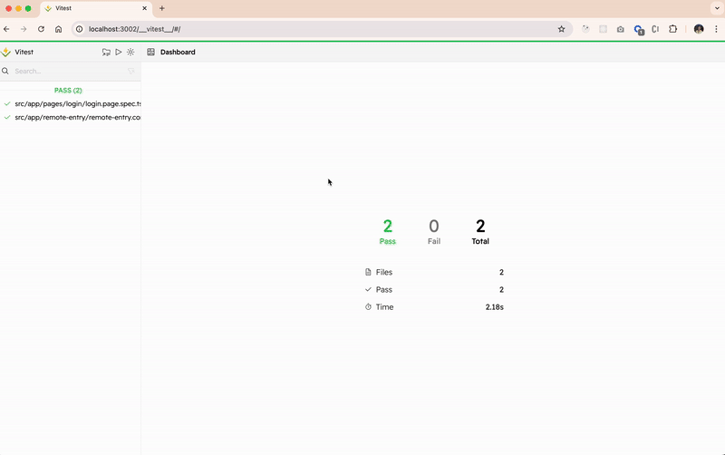
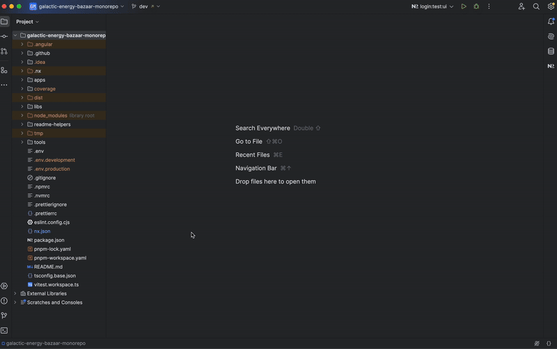

# Libraries (`libs`)

## Description
The `libs` folder contains reusable libraries that provide core functionalities, UI components, and state management utilities across the micro-frontends. These libraries ensure modularity, maintainability, and scalability within the monorepo.

---

## Structure
The `libs` folder is structured as follows:

- **`feds-cdk/`**: Frontend Design System (Component Development Kit) containing reusable UI components.
- **`feds-core/`**: Core logic shared across applications, such as authentication, environment configurations, and internationalization.
- **`feds-styles/`**: Centralized theme and styles shared across the micro-frontends.
- **`stores/`**: State management libraries using NgRx Signals for managing application data.

---

## **feds-cdk (Component Development Kit)**
This library contains reusable UI components to ensure a consistent design system across applications.

### Components
- **`feds/cdk-side-nav`**: Provides the left navigation sidebar for the Shell application.
- **`feds/cdk-rotating-img`**: A component for rendering an animated rotating image.

---

## **feds-core (Core Logic)**
This library contains essential logic shared across applications, including authentication, environment management, and internationalization.

### Modules
- **`auth/`**: Implements authentication and role-based access control.
- **`env/`**: Provides environment configuration services.
- **`i18n/`**: Manages multi-language support using ngx-translate.


---

## **feds-styles (Global Styles and Theming)**
This library centralizes the styles and theme configurations for the project.

### Features
- Implements Angular Material theming for consistency across applications.
- Defines global SCSS variables and mixins for styling standardization.
- Ensures a uniform look and feel across all micro-frontends.

---

## **Stores (State Management using NgRx Signals)**
This library provides state management solutions for handling planetary data, trades, and real-time updates.

### Stores
- **`store-planets`**: Manages planetary data fetched from the API.
- **`store-trades`**: Handles trade transactions.
- **`store-socket-io`**: Listens for real-time trade notifications via WebSockets.

---

## Scripts
Run the following commands from the project root to manage and build libraries:

- **Build all libraries**:
  ```bash
  pnpm build:libs
  ```

- **Run tests for all libraries**:
  ```bash
  pnpm test:all
  ```

- **Run tests for a specific project** (replace `$PROJECT`):
  ```bash
  PROJECT=login pnpm test:project
  ```
- **Run tests with the Vitest UI** (replace `$PROJECT`):
  ```bash
  PROJECT=podcast pnpm test:project:ui
  ```

  #### **With Nx Console**:

  

  #### **With the terminal**:

  

  #### **Vitest UI**

  

---

## Notes
1. The `libs` folder is designed for reusability across multiple applications.
2. Ensure all libraries are built before serving any application that depends on them.
3. Use **`nx graph`** to visualize library dependencies across the monorepo.




---
For more information, consult the general documentation in the root README.
